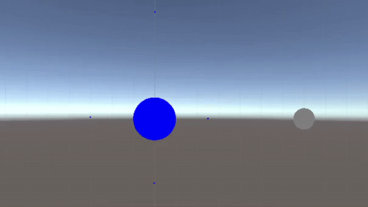
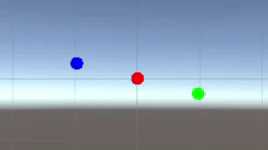
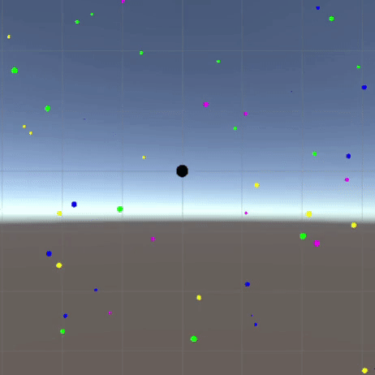
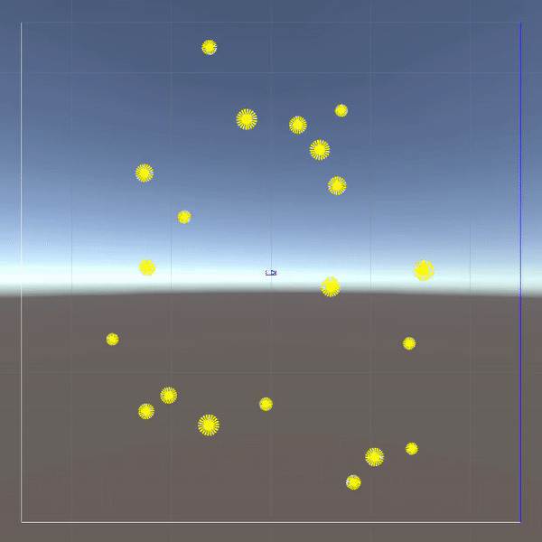
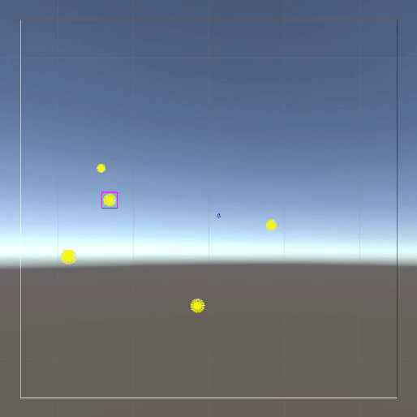

# Gravity
Project based on the gravity forces, made in one week.

## Project description
This project is made in Unity just to exploit the debug functions to draw lines and make a visible output.
The purpose is to take advantage of the OOP qualities and make interaction with the Gravity.

### Classes
Abstract class and inheritance are used as a solid skeleton behind the project. In particular there are:
* System class, which handles input and disposes all the objects in the scene. The extension class GameSystem makes it possible to control objs and set the end of the game.
* Render class has primitive functions to draw figures and a pipeline of actions to be performed each update. Planets, stars, explosions and spaceships all derive from this class.
* Entity class is the essenzial class for each object in the scene. It has his render binded and a behaviour.
* EntityBehaviour, it is the class responsible for the movement. It is based on the law of universal gravitation.
 
### Scenes
The scenes created show the potential of the project. Here some examples:

#### World, mood and spaceships

#### Infinite loop, inspired by the [Remarkable periodic solution of the three-body](https://arxiv.org/abs/math/0011268)

#### Black hole
  

#### Escape from stars

#### Help the spaceship and save the universe

